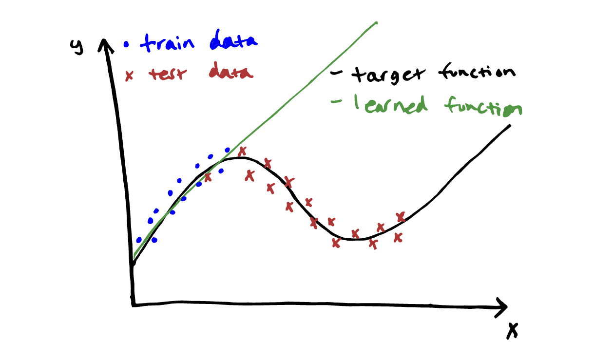
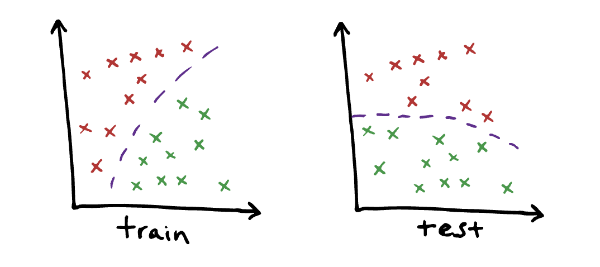
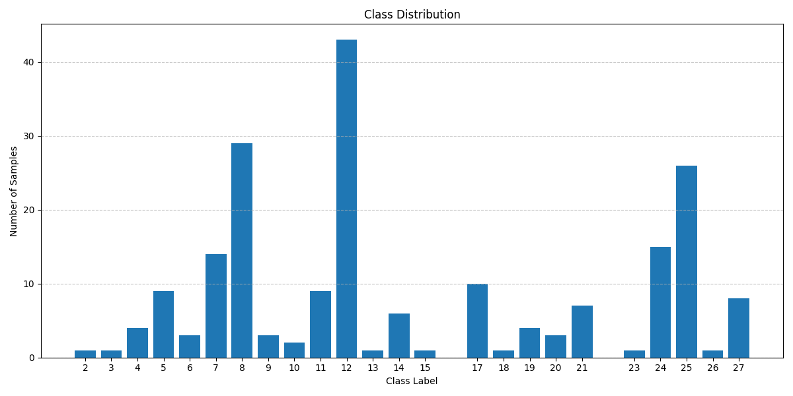

# Researching Distribution Shifting

Sources:

Initial Reading: 
- https://dcai.csail.mit.edu/2024/imbalance-outliers-shift/
- https://www.cis.upenn.edu/~exwong/assets/debugml/distribution_shift.pdf

To sumarise these two above sources, there are three types of distribution shift
to consider
1. **Covariate shift**
Where p(x) changes. That is the likelyhood of getting a particular vector of features
changes but the overall relationship between input (x) and output (y) stays the same.
The reason this is problematic can be summarised by the below image:

2. **Label Shifting**
Where p(y) changes but p(x | y) stays the same. So class priors change but the way
the class 'looks' - that is what the features look like for each class - remains the same. Only be applied to y --> x problems - where the class of y affects the features x.
I believe this is relevant to our task.

3. **Concept Shifting**
Where p(y | x) changes but p(x) does not. So while you expect to see the same inputs,
the outputs - which class you assign to which input - changes. This would happen if your
understanding of the classes changes. See the below diagram for greater clarity.

Below is the distribution bar chart for the classes of the known test data of Test2 (the 
first 202 samples). This distribution indicates that we could be seeing label shifting since
it is so drastically different to the distribution of classes in the training data (see Vansh's notebook for original distribution)

## Methods of Detection

### Maximum Mean Discrepancy - Covariate Shifting
Resources
- https://www.youtube.com/watch?v=5qNKolRwOkQ
- https://proceedings.neurips.cc/paper_files/paper/2019/file/846c260d715e5b854ffad5f70a516c88-Paper.pdf

The YT vid Good for understanding MMD - Maximum Mean Discrepancy
Good way to check if the input data (features) have shifted - that is whether there
is covariate shifting. 

The second resource _mentions_ that you can obtain a p-value for the MMD by using a **permutation** test

I have written a naive Permutation Test to for checking the p value. 

**Conclusion**

Cannot reject the null hypothesis (the two input distributions are equal) because p is NOT low enough.

### Black Box Shift Estimation - Label Shifting

**Resources**
https://assets.amazon.science/53/21/14143d6c4ecbb9b1ccdbd71162bd/detecting-and-correcting-for-label-shift-with-black-box-predictors.pdf

Estimating the ratio of $$\frac{q_{y_l}}{p_{y_l}}$$ for each label (or class) *l*
where q is a _new_ distribution and p is the _original_ distribution

Assumptions made
1. $$p(x | y) = q(x | y)
That is to say, given a particular class, the features look the same (previously described in introduction to label shifting)

2. In the training data, there is an instance of every class

3. Something about a matrix that is invertible i dont really know

The conclusion that I have drawn is that I can use the same **MMD** technique to check the distribution of the labels I *have* been given from Data Test 2 and compare it to the distribution of the labels I have been given from the training set.

