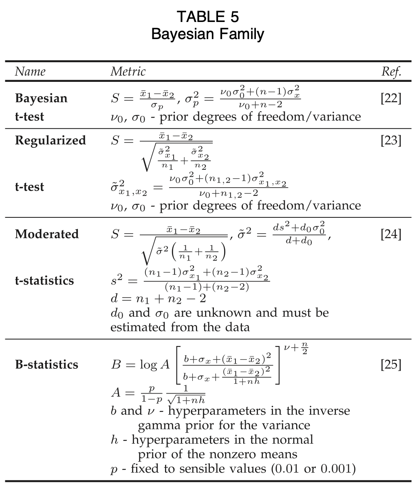

# Feature Selection

## Reading

[A Survey on feature selection methods](https://www.sciencedirect.com/science/article/pii/S0045790613003066)

Filter, Wrapper and Embedded methods

## Filter Methods

[//]: # (- Correlation criteria)

[//]: # (	- Pearson correlation coefficient)

[//]: # (	    - Detects linear dependencies between variable and target)

[//]: # (- Mutual Information)

[//]: # (	- measure of dependency between two variables)

[//]: # (	- how much information about Y can we gain by analysing X &#40;where X and Y are features for a certain output&#41;?)

[//]: # ()
[//]: # (We can then rank features based on how well they perform on these. However, there is **no method** for determining the ideal dimension of the feature space.)

[//]: # ()
[//]: # (These methods may also discard features that are only informative when combined with other features. Features are compared by themselves.)

[//]: # ()
[//]: # (Since they are irrespective/applied before the model, we might not get the optimal subset of features for that specific model.)

> The advantages of feature ranking are that it is computationally light and avoids overfitting and is proven to work well for certain datasets

The paper refers to the following 'certain datasets':
- A Survey on Filter Techniques for Feature Selection in Gene Expression Microarray Analysis
	- This study may be related: they struggle with a small set of samples in GEM experiments. This reflects the class imbalance in our dataset.
	- They compared scoring functions:

- This prompted me to investigate bayesian scoring functions.

#### Bayesian Family of Scoring Functions

> In order to cope with the weak empirical estimation of variance across a single feature/gene, several authors proposed more robust estimations of the variance by adding genes with similar expression values.

- This refers to making predictions of classes when we have a high-dimensional feature space but a limited set of samples. Due to our imbalanced data set, this seems appropriate to investigate.

- Hence we will investigate using bayesian estimation for feature selection. We have a complex data set with limited samples for a lot of classes. This fits the use case for bayesian estimation.

After brief investigation, found that bayesian methods are very computationally expensive. This made it infeasible.

For example, bayesian estimation requires calculating a score from all subsets of the feature set.
For 300 features this is obviously a huge number.

Hence we move on to other filter methods.

### Other Filtering Methods

Correlation filtering, variance thresholding and lasso.

these are more simple methods but are still useful.

Variance thresholding works on the fact that features with a small variance do not contribute much to the classification.

Correlation filtering removes features that mirror other features behaviour, simplifying the feature space

LASSO works by penalising feature coefficients, eventually driving some to 0

### Markov Chain Monte Carlo

This is a sampling method used in stats. Used for sampling with high dimensional probability distributions

Essentially gives a probability on how useful a given feature is.

